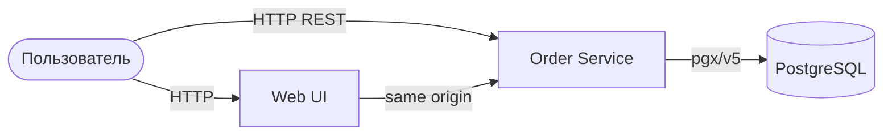

# Spaceship Orders


**Spaceship Orders** — клиент-серверное приложение для управления заказами космических кораблей.
Бэкенд на Go (HTTP/REST + PostgreSQL), простой веб-UI раздаётся тем же сервисом.

---

## Архитектура



Слои Order-сервиса (Clean Architecture):

- **API** — OpenAPI / ogen handlers
- **Service** — бизнес-логика
- **Repository** — доступ к PostgreSQL
- **Frontend** — статический UI (`/`, `/app.js`, `/styles.css`)

---

## Стек

| Компонент | Технология |
|:----------|:-----------|
| Backend | Go 1.26 |
| API | HTTP/REST, OpenAPI 3 + ogen |
| Frontend | HTML / CSS / JS |
| БД | PostgreSQL (pgx/v5, goose-миграции) |
| Логи | Zap → stdout |
| Метрики | Prometheus (`/metrics`) |
| Трейсинг | OpenTelemetry (опционально через env) |
| Инфра | Docker Compose, Taskfile |
| Качество | golangci-lint, gofumpt, gci, mockery |

---

## API (CRUD)

| Операция | Метод | Путь |
|:---------|:------|:-----|
| Create | `POST` | `/api/v1/orders` |
| List | `GET` | `/api/v1/orders` |
| Read | `GET` | `/api/v1/orders/{order_uuid}` |
| Pay (Update) | `POST` | `/api/v1/orders/{order_uuid}/pay` |
| Cancel (Update) | `POST` | `/api/v1/orders/{order_uuid}/cancel` |
| Delete | `DELETE` | `/api/v1/orders/{order_uuid}` |

Служебные эндпоинты: `GET /health`, `GET /metrics`.

---

## Структура репозитория

Монорепозиторий (Go Workspaces):

| Путь | Назначение |
|:-----|:-----------|
| [order/](./order) | Order Service: cmd, API, service, repository, миграции, тесты |
| [frontend/](./frontend) | Веб-UI (создание / список / pay / cancel / delete) |
| [shared/](./shared) | OpenAPI-схемы и сгенерированный HTTP-код (ogen) |
| [platform/](./platform) | Общие библиотеки: logger, closer, migrator, tracing |
| [deploy/](./deploy) | Docker, Compose, env-шаблоны |

---

## Быстрый старт

### Требования

1. Docker & Docker Compose
2. Go 1.26 (для локальной разработки)
3. [Task](https://taskfile.dev/) (`go-task`)

### Переменные окружения

```bash
task env:generate
```

Создаёт `deploy/compose/order/.env` из шаблонов в `deploy/env/`.

### Запуск (Docker)

```bash
task up
# или: task up-order
```

Поднимает PostgreSQL и Order Service.

| Что | URL |
|:----|:----|
| Web UI | http://localhost:8081/ |
| API | http://localhost:8081/api/v1/orders |
| Health | http://localhost:8081/health |
| Metrics | http://localhost:8081/metrics |
| Postgres | `localhost:5432` (см. `.env`) |

Остановка:

```bash
task down
# или: task down-order
```

### Локальный запуск без Docker-образа приложения

Нужен запущенный Postgres (например, только `orders_db` из compose) и корректный `.env`:

```bash
task env:generate
task run
```

UI подхватывается из каталога `frontend/` (или из `FRONTEND_DIR`).

---

## Основные команды Task

| Команда | Описание |
|:--------|:---------|
| `task env:generate` | Сгенерировать `.env` для Order |
| `task migrate` | One-off: применить goose-миграции к PostgreSQL |
| `task migrate:status` | Статус миграций |
| `task migrate:down` | Откатить последнюю миграцию |
| `task up` / `task up-order` | Поднять Postgres + Order |
| `task down` / `task down-order` | Остановить compose (с volumes) |
| `task run` | Локальный `go run` Order |
| `task gen` | Перегенерировать OpenAPI → Go (ogen) |
| `task mockery:gen` | Сгенерировать моки |
| `task deps:update` | `go mod tidy` в order / shared / platform |
| `task test` | Юнит-тесты order |
| `task test-coverage` | Покрытие service/repository |
| `task coverage:html` | HTML-отчёт покрытия |
| `task test-integration` | Интеграционные тесты (Docker + Postgres) |
| `task format` | gofumpt + gci |
| `task lint` | golangci-lint |

Список всех задач: `task --list`.

---

## Кодогенерация

После изменения OpenAPI в [shared/api/orders](./shared/api/orders):

```bash
task gen
task mockery:gen
task deps:update
```

---

## Тестирование и качество

```bash
task test
task test-coverage
task coverage:html
task test-integration
task format
task lint
```

CI: [.github/workflows/ci.yml](./.github/workflows/ci.yml) — lint и тесты.
