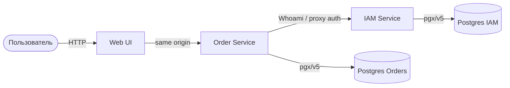

# Spaceship Orders


**Spaceship Orders** — клиент-серверное приложение для управления заказами космических кораблей.
Бэкенд на Go (HTTP/REST + PostgreSQL), простой веб-UI раздаётся тем же сервисом.

---

## Архитектура



Слои сервисов (Clean Architecture):

- **API** — OpenAPI / ogen handlers
- **Service** — бизнес-логика
- **Repository** — доступ к PostgreSQL
- **Frontend** — статический UI (`/`, `/app.js`, `/styles.css`), auth через Order proxy

---

## Стек

| Компонент | Технология |
|:----------|:-----------|
| Backend | Go 1.26 |
| API | HTTP/REST, OpenAPI 3 + ogen |
| Auth | IAM: register/login/session (Postgres), заголовок `X-Session-Uuid` |
| Frontend | HTML / CSS / JS |
| БД | PostgreSQL (pgx/v5, goose-миграции) |
| Логи | Zap → stdout |
| Метрики | Prometheus (`/metrics` на Order) |
| Трейсинг | OpenTelemetry (опционально через env) |
| Инфра | Docker Compose, Taskfile |
| Качество | golangci-lint, gofumpt, gci, mockery |

---

## API

### Order (CRUD)

| Операция | Метод | Путь |
|:---------|:------|:-----|
| Create | `POST` | `/api/v1/orders` |
| List | `GET` | `/api/v1/orders` |
| Read | `GET` | `/api/v1/orders/{order_uuid}` |
| Pay (Update) | `POST` | `/api/v1/orders/{order_uuid}/pay` |
| Cancel (Update) | `POST` | `/api/v1/orders/{order_uuid}/cancel` |
| Delete | `DELETE` | `/api/v1/orders/{order_uuid}` |
| Payments by order | `GET` | `/api/v1/orders/{order_uuid}/payments` |
| Payment by UUID | `GET` | `/api/v1/payments/{payment_uuid}` |

### Parts (CRUD)

| Операция | Метод | Путь |
|:---------|:------|:-----|
| Create | `POST` | `/api/v1/parts` |
| List | `GET` | `/api/v1/parts` |
| Read | `GET` | `/api/v1/parts/{part_uuid}` |
| Update | `PUT` | `/api/v1/parts/{part_uuid}` |
| Delete | `DELETE` | `/api/v1/parts/{part_uuid}` |

Все Order/Parts endpoints требуют заголовок `X-Session-Uuid`.

### IAM (auth)

| Операция | Метод | Путь |
|:---------|:------|:-----|
| Register | `POST` | `/api/v1/auth/register` |
| Login | `POST` | `/api/v1/auth/login` |
| Logout | `POST` | `/api/v1/auth/logout` |
| Whoami | `GET` | `/api/v1/auth/whoami` |

С UI удобнее ходить на Order (`:8081`) — он проксирует `/api/v1/auth/*` на IAM.

Служебные: `GET /health`, `GET /metrics` (Order).

---

## Структура репозитория

Монорепозиторий (Go Workspaces):

| Путь | Назначение |
|:-----|:-----------|
| [order/](./order) | Order Service: cmd, API, service, repository, миграции, тесты |
| [iam/](./iam) | IAM Service: регистрация, логин, сессии в Postgres |
| [frontend/](./frontend) | Веб-UI (auth + каталог деталей + заказы) |
| [shared/](./shared) | OpenAPI-схемы и сгенерированный HTTP-код (ogen) |
| [platform/](./platform) | Общие библиотеки: logger, closer, migrator, tracing |
| [deploy/](./deploy) | Docker, Compose, env-шаблоны |

---

## Быстрый старт

### Требования

1. Docker & Docker Compose
2. Go 1.26 (для локальной разработки)
3. [Task](https://taskfile.dev/) (`go-task`)

### Переменные окружения

```bash
task env:generate
```

Создаёт `deploy/compose/order/.env` и `deploy/compose/iam/.env` из шаблонов в `deploy/env/`.

### Запуск (Docker)

```bash
task up
```

Поднимает IAM (Postgres + сервис) и Order (Postgres + сервис) в общей сети `spaceship_network`.

| Что | URL |
|:----|:----|
| Web UI | http://localhost:8081/ |
| Order API | http://localhost:8081/api/v1/orders |
| Auth API (через Order proxy) | http://localhost:8081/api/v1/auth/* |
| IAM напрямую | http://localhost:8082/api/v1/auth/* |
| Health Order | http://localhost:8081/health |
| Health IAM | http://localhost:8082/health |

Остановка:

```bash
task down
```

### Локальный запуск без Docker-образа приложения

Нужны Postgres для Order и IAM (или `task up` только БД-контейнеров) и корректный `.env`. Для доступа с хоста в `deploy/compose/order/.env` укажите `IAM_HTTP_BASE_URL=http://localhost:8082` и `POSTGRES_HOST=localhost` (аналогично для IAM).

```bash
task env:generate
task run-iam   # в одном терминале
task run       # в другом
```

UI подхватывается из каталога `frontend/` (или из `FRONTEND_DIR`).

---

## Основные команды Task

| Команда | Описание |
|:--------|:---------|
| `task env:generate` | Сгенерировать `.env` для Order и IAM |
| `task up` / `task down` | Поднять / остановить IAM + Order |
| `task up-iam` / `task up-order` | Поднять сервисы по отдельности |
| `task run` / `task run-iam` | Локальный `go run` |
| `task migrate` | One-off: goose-миграции Order |
| `task gen` | Перегенерировать OpenAPI → Go (ogen) |
| `task mockery:gen` | Сгенерировать моки |
| `task deps:update` | `go mod tidy` в order / iam / shared / platform |
| `task test` | Юнит-тесты order |
| `task test-coverage` | Покрытие service/repository |
| `task coverage:html` | HTML-отчёт покрытия |
| `task test-integration` | Интеграционные тесты (Docker + Postgres) |
| `task format` | gofumpt + gci |
| `task lint` | golangci-lint |

Список всех задач: `task --list`.

---

## Кодогенерация

После изменения OpenAPI в [shared/api/orders](./shared/api/orders) или [shared/api/iam](./shared/api/iam):

```bash
task gen
task mockery:gen
task deps:update
```

---

## Тестирование и качество

```bash
task test
task test-coverage
task coverage:html
task test-integration
task format
task lint
```

CI: [.github/workflows/ci.yml](./.github/workflows/ci.yml) — lint и тесты.
