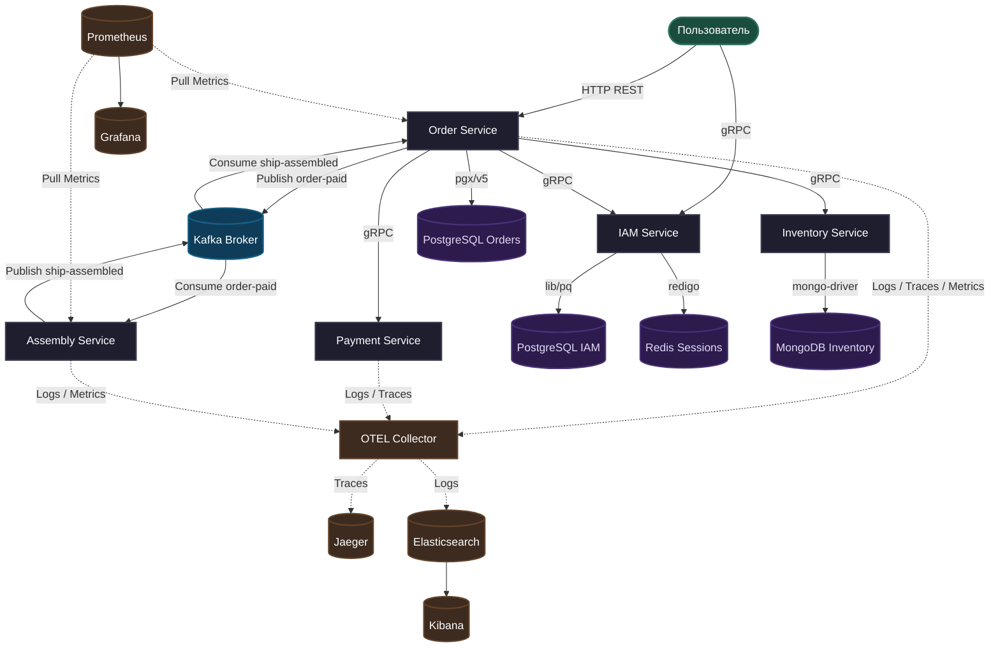

# 🚀 Spaceship Orders


**Spaceship Orders** - это распределённая микросервисная платформа для заказа, оплаты и сборки космических кораблей. Проект спроектирован по принципам чистой архитектуры и включает полный комплекс систем наблюдения

---

## Архитектура системы

Взаимодействие компонентов системы построено на сочетании синхронного (gRPC) и асинхронного (Apache Kafka) подходов:



---

## Технологический стек

Проект разработан с использованием современного стека технологий, ориентированного на производительность и строгую типизацию контрактов:

| Слой / Компонент            | Технология                                     | Описание                                                                    |
|:----------------------------|:-----------------------------------------------|:----------------------------------------------------------------------------|
| **Язык разработки**         | **Go 1.26**                                    | Использование новейших возможностей языка для высокой производительности.   |
| **Синхронный транспорт**    | **gRPC & REST**                                | Внутреннее взаимодействие по gRPC, внешнее по HTTP                          |
| **Генерация кода API**      | **OpenAPI (Ogen) & Protobuf (Buf)**            | Схемы являются единственным источником правды                               |
| **Брокер сообщений**        | **Apache Kafka (Sarama)**                      | Асинхронный event-driven пайплайн для сборки кораблей                       |
| **Базы данных**             | **PostgreSQL (pgx/v5), MongoDB, Redis**        | Оптимальный выбор СУБД под задачи каждого отдельного микросервиса           |
| **Распределённый трейсинг** | **OpenTelemetry Go SDK & Jaeger**              | Сквозная трассировка запросов (HTTP -> Order -> gRPC -> Payment)            |
| **Централизованные логи**   | **Zap, OTEL Collector, Elasticsearch, Kibana** | Двойная запись логов (stdout + OTLP/gRPC) в структурированном JSON          |
| **Метрики и Мониторинг**    | **Prometheus & Grafana**                       | Сбор бизнес-метрик и технической гистограммы длительности операций          |
| **Качество кода**           | **Golangci-lint, Gofumpt, Gci**                | Строгие правила форматирования кода и статического анализа                  |
| **Тестирование**            | **Testcontainers-go, Mockery**                 | Компонентные тесты в изолированных контейнерах Docker и автогенерация моков |
| **Оркестрация**             | **Docker Compose, Taskfile**                   | Удобное локальное окружение и автоматизация рутинных действий               |

---

## Observability & Мониторинг
Система полностью инструментирована для наблюдения за состоянием микросервисов в реальном времени

### Распределённый трейсинг (OpenTelemetry + Jaeger)

Реализован сквозной проброс Trace Context через HTTP-заголовки и gRPC-метаданные. Сценарий оплаты `PayOrder` формирует целостный дерево-трейс:

- `OrderService` (HTTP Handler) -> `OrderService` (Business Logic) -> `PaymentClient` (gRPC Outgoing) -> `PaymentService` (gRPC Server) -> `ProcessPayment` (Domain)


### Централизованное логирование (EFK / OTLP)

Платформенный логгер (`/platform/pkg/logger`) поддерживает мульти-экспорт:

1. **stdout**: Консольная печать

2. **OTLP/gRPC**: Прямая отправка батчей в `otel-collector` (порт `4317`) с дублированием логов в Elasticsearch и визуализацией в Kibana

3. Логи автоматически обогащаются полями `trace_id` и `user_id` из контекста вызова


### 📊 Метрики и Дашборды (Prometheus + Grafana)

В сервисы добавлены ключевые метрики:

- `orders_total` — счётчик созданных заказов (`OrderService`)

- `orders_revenue_total` — суммарная выручка (`OrderService`)

- `assembly_duration_seconds` — гистограмма времени сборки корабля (`AssemblyService`)


| Сервис     | URL                      | Назначение                                    |
| ---------- | ------------------------ | --------------------------------------------- |
| Jaeger UI  | `http://localhost:16686` | Поиск и анализ распределённых трейсов         |
| Kibana     | http://localhost:5601    | Просмотр и фильтрация централизованных логов  |
| Grafana    | http://localhost:3000    | Визуализация метрик и дашбордов (admin/admin) |
| Prometheus | http://localhost:9090    | Просмотр метрик и выполнения PromQL-запросов  |
| Kafka UI   | http://localhost:8080    | Мониторинг топиков и групп консьюмеров Kafka  |


## Структура репозитория

Проект организован в виде монорепозитория (Go Workspaces):

*   [assembly/](./assembly) — микросервис сборки кораблей (эмулирует физический процесс сборки, потребляя события из Kafka)
*   [iam/](./iam) — сервис идентификации и аутентификации (регистрация, логин, сессии в Redis)
*   [inventory/](./inventory) — каталог запчастей и комплектующих для космических кораблей (хранилище MongoDB)
*   [order/](./order) — ядро системы: создание заказов, расчет стоимости, API для клиентов, генерация метрик выручки, инициатор трейсо
*   [payment/](./payment) — сервис-заглушка для имитации транзакций оплаты (подхватывает OTel context из gRPC)
*   [platform/](./platform) — общая разделяемая библиотека (логирование stdout+OTLP, трейсинг OpenTelemetry, Graceful Shutdown, обертки над gRPC/Kafka/Redis)
*   [shared/](./shared) — общие схемы Protobuf/OpenAPI и сгенерированный на их основе код
*   [deploy/](./deploy) — инфраструктурные манифесты, Dockerfile, конфигурации OTel Collector, Prometheus, Grafana и конфигурационные файлы Docker Compose

---

##  Быстрый старт

### Требования
Для локального запуска вам понадобятся:
1. **Docker & Docker Compose**
2. **Go 1.26** (для локальной разработки)
3. **Task** (`go-task` для запуска автоматизированных сценариев)

###  Генерация переменных окружения

```bash
task env:generate
```

### Запуск микросервисов
```bash
task up-all
```

### Остановка всех контейнеров
```bash
task down-all
```

---

## Тестирование и проверка качества кода

В проекте настроен надежный пайплайн тестирования и статического анализа:

### Юнит-тестирование
Запуск быстрых изолированных юнит-тестов для всех модулей:
```bash
task test
```

### Расчёт покрытия (Code Coverage)
Запуск тестов с вычислением тестового покрытия бизнес-логики (`service` и `repository` слоёв) с выводом красивого HTML-отчета:
```bash
# Генерация консольного отчёта
task test-coverage

# Генерация HTML и автоматическое открытие в браузере
task coverage:html
```

### Проверка стиля и Линтинг
Автоматическое форматирование кода (сортировка импортов, приведение к единому стилю) и запуск линтеров:
```bash
# Форматирование gofumpt + gci
task format

# Статический анализ golangci-lint
task lint
```

### Сценарные тесты
Вы можете запустить готовые сценарии проверки авторизации и межсервисного взаимодействия:
```bash
# Тест сценария регистрации, входа и получения профиля в IAM
task test-iam

# Тест сквозного создания заказа с авторизацией сессии
task test-api-with-auth
```

---

## Кодогенерация

Если вы изменили контракты `.proto` в [shared/proto](./shared/proto) или OpenAPI схемы в [shared/api](./shared/api):

1. Установите необходимые утилиты (`buf`, `ogen`, `yq`, `mockery` и др.) и сгенерируйте код:
   ```bash
   task gen
   ```
2. Обновите моки для юнит-тестов:
   ```bash
   task mockery:gen
   ```
3. Выполните синхронизацию зависимостей во всех модулях:
   ```bash
   task deps:update
   ```


## Статус разработки

Проект разрабатывается итеративно. На данный момент полностью реализована микросервисная база и событийная модель взаимодействия (завершены первые 6 недель дорожной карты)

- [x] **Фаза 1–2: Базовые микросервисы и CI/CD**
    - Реализовано синхронное взаимодействие по HTTP/REST и gRPC (сервисы Order, Inventory, Payment)
    - Внедрена Clean Architecture, написаны интеграционные тесты с Testcontainers
    - Настроены пайплайны GitHub Actions для проверки качества кода
- [x] **Фаза 3: Event-Driven архитектура**
    - Поднят брокер Apache Kafka (KRaft)
    - Настроены консьюмеры и продюсеры для асинхронных процессов (Assembly Service, Notification Service)
    - Окружение полностью упаковано в Docker Compose
- [x] **Фаза 4: Observability (В процессе)**
    - Инструментирование Go-кода: сбор бизнес-метрик (Prometheus), распределенная трассировка (OpenTelemetry + Jaeger) и централизованное логирование
